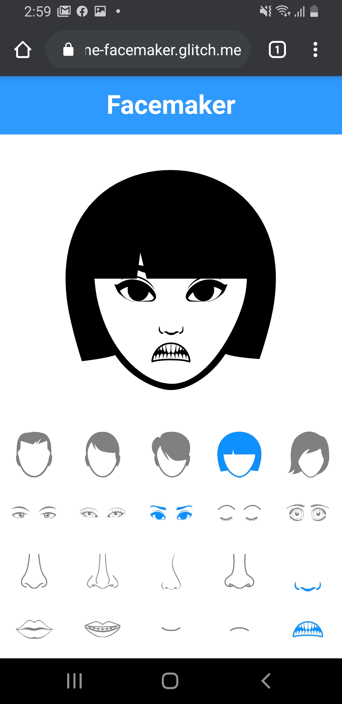

# Facemaker


## Description

This repo is the week4 assignment of the "Hand Held: Creative Tools for Phones" course at ITP.  
The assignment was to design an interface that allows the user to combine image layers in different ways and producing artworks.  
I decided to create a simple avatar creator that could be used for an online chatroom.

Here's the [Live Demo on Glitch](https://cuinjune-facemaker.glitch.me/).

The images used in the app are downloaded from [Noun Project](https://thenounproject.com/).

## Setup

1. You need to have [Python](https://realpython.com/installing-python/) installed on your computer
2. Run the following commands in the Terminal
```
git clone https://github.com/cuinjune/facemaker.git
cd facemaker
python -m http.server 8080
```
3. Open your web browser and navigate to http://localhost:8080

## Author
* [Zack Lee](https://www.cuinjune.com/about): an MPS Candidate at [NYU ITP](https://itp.nyu.edu).
